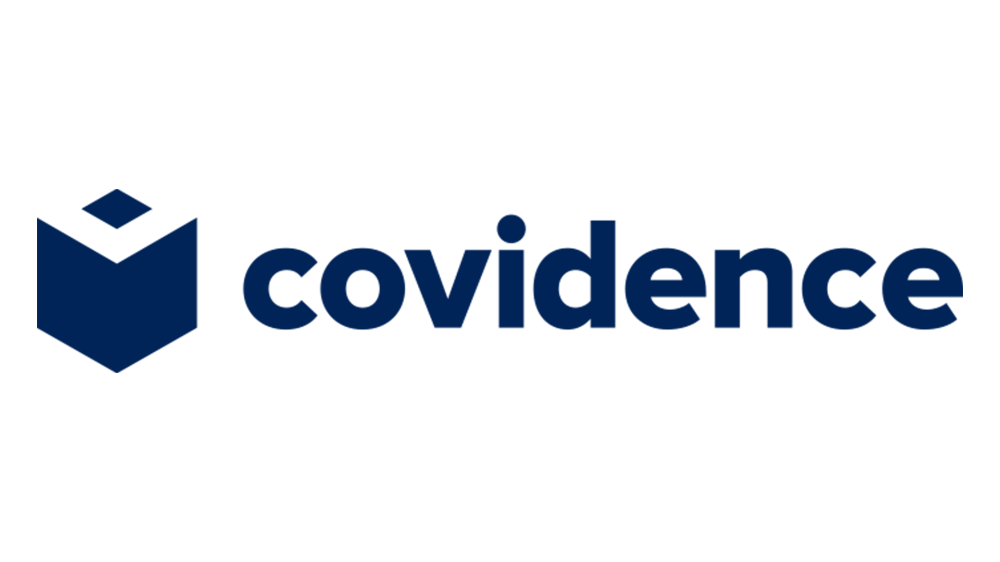

 

# Covidence, and Introduction

- Pre-workshop activities: 5 min 
- Introductory presentation: 12 min
- Hands-on activities: 30 min

## Why Covidence? 

[Covidence](https://www.covidence.org/){:target="_blank"} is a web-based platform that streamlines the process of conducting comprehensive literature reviews, including systematic reviews, scoping reviews, meta-syntheses, and meta-narratives.

Covidence is ideal for team collaboration and allows multiple reviewers to work on a project simultaneously; however, it can also be used individually. Covidence bundles citation screening, full-text review, risk of bias assessment, and the exportation of data and references together onto one platform saving researchers valuable time and improving the quality of evidence synthesis. 

## Learning objectives

At the end of this workshop, you will be able to:

1. Explain that Covidence bundles duplication detection, reference screening, and full text review into a single web-based platform
2. Classify Covidence as a multidisciplinary tool
3. Create a review and perform the following steps:
- Adjust review & team settings
- Import references
- Screen title and abstracts
- Import full text
- Screen full text
5. Recognize how Covidence improves collaboration and evidence synthesis

[NEXT STEP: Pre-Workshop Activities](pre-workshop.html){: .btn .btn-blue }
